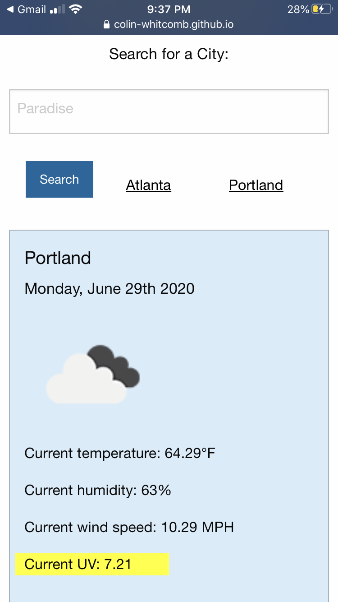
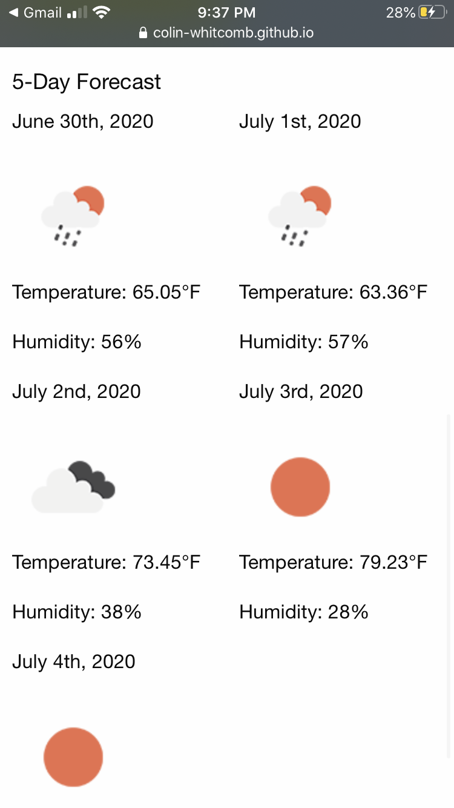

# Colin Whitcomb 

## Deployed Site
1) https://colin-whitcomb.github.io/weather-dashboard/
___
## Summary & Processs

In this assignment our objective was to create a weather dashboard that would display current and future weather information and predictions. The current weather information had to include  temperature, humidity, wind speed, and UV. The five day forecast displays similar yet condensed information. 

My design process began by structuring basic HTML and CSS elements, layout, and style for the page; I used Zurb Foundation as a CSS framework. Next, I tackled the script.js file in order (top to bottom) of operations on the page. A majority of the assignment was spent creating accurate ajax calls to the  https://openweathermap.org/api and manipulating/populating the DOM with accurate information. 

After the operations were working well, I spent a little more time on styling edits to clean up the display. Since Foundation is a mobile-first framework, I prioritized mobile stylings (see below).

___
## Screenshots 

1. **Screen Recording - Mobile**

2. **Top Display**

3. **5-Day Forecast**

___
## Technologies / Resources
- Zurb Foundation
- Javascript / jQuery
- HTML / CSS  
- Visual Studio Code
- Git / GitHub / GitPages
--- 
## Author

**Colin Whitcomb** [LinkedIn](https://ww.linkedin.com/in/colin-whitcomb-b808301a6/)

___
